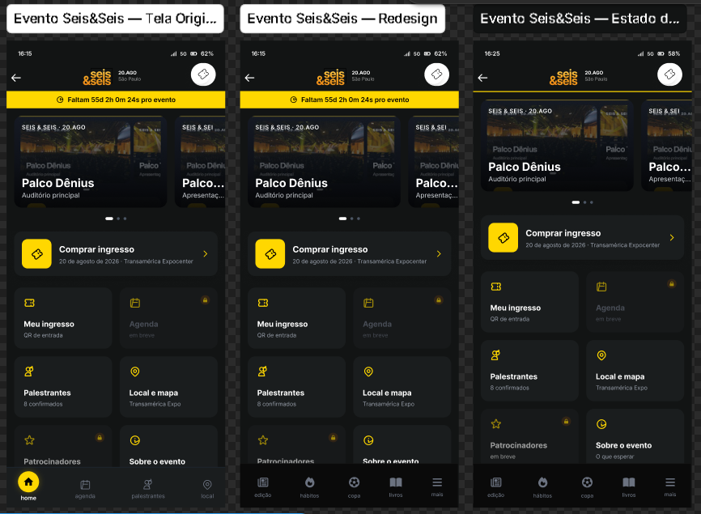

# The News Case

> Implementação Front-end em React + TypeScript do redesign proposto para o processo seletivo **Dev Front-end & Design** do **The News**.


---

## 📖 Sobre o projeto

Este projeto consiste na implementação Front-end do redesign desenvolvido para o case técnico do processo seletivo da **The News**.

O objetivo foi reproduzir com fidelidade a interface proposta no Figma utilizando React e TypeScript, priorizando:

- componentização;
- reutilização de código;
- responsividade;
- organização da arquitetura;
- boas práticas de desenvolvimento.

Além da implementação, foi elaborado um estudo completo contendo a auditoria do produto, decisões de UX/UI, redesign das telas e autocrítica do projeto.

---

## 🎯 Objetivos da implementação

A implementação buscou refletir não apenas o layout criado no Figma, mas também uma arquitetura que pudesse evoluir facilmente.

Durante o desenvolvimento foram priorizados:

- componentes reutilizáveis;
- separação entre layout e conteúdo;
- estrutura escalável;
- código tipado com TypeScript;
- organização por responsabilidade;
- responsividade para dispositivos móveis.

---

## 📱 Tela implementada

Atualmente o projeto possui implementação funcional da tela:

- ✅ News

O redesign da tela **Evento Seis&Seis** encontra-se documentado no Figma e descrito no estudo do case.

A implementação priorizou a tela **News** por concentrar as principais decisões de arquitetura e representar o principal fluxo de consumo de conteúdo do aplicativo.

---

## ✨ Funcionalidades

- Header responsivo
- Header colapsável durante o scroll
- Navegação inferior fixa
- Lista de categorias
- Cards de notícias
- Carrosséis horizontais
- Componentes reutilizáveis
- Layout responsivo
- Navegação entre páginas utilizando React Router

---

## 🏗 Arquitetura

O projeto foi organizado buscando facilitar manutenção e evolução futura.

```
src/
│
├── assets/          # imagens e ícones
├── components/      # componentes reutilizáveis
├── hooks/           # hooks customizados
├── layout/          # estrutura da aplicação
├── pages/           # páginas
├── routes/          # configuração das rotas
├── styles/          # estilos globais
├── theme/           # tokens visuais
└── main.tsx
```

---

## 🧩 Componentização

Durante a implementação foram criados componentes reutilizáveis para reduzir duplicação de código e facilitar manutenção.

Entre eles:

- AppHeader
- Navigation
- NewsCard
- GridCard
- Carousel
- Button
- Chip
- Section
- CategoryList

A lógica de cada componente foi isolada, permitindo reutilização em diferentes contextos.

---

## 🎨 Design

A implementação procura reproduzir fielmente o redesign criado no Figma.

Foram respeitados:

- identidade visual da marca;
- escala tipográfica;
- espaçamentos;
- cores;
- hierarquia visual;
- comportamento durante scroll.

---

## ♿ Acessibilidade

Durante a implementação foram considerados alguns princípios básicos de acessibilidade:

- estrutura semântica utilizando HTML5;
- navegação consistente;
- contraste adequado;
- áreas de clique confortáveis;
- componentes reutilizáveis preparados para evolução futura.

---

## 🚀 Tecnologias

- React
- TypeScript
- Vite
- React Router
- CSS Modules

---

## 💻 Como executar

Clone o repositório:

```bash
git clone https://github.com/IsaiasSantanaDosSantos/the-news-case.git
```

Entre na pasta:

```bash
cd the-news-case
```

Instale as dependências:

```bash
pnpm install
```

Execute o projeto:

```bash
pnpm dev
```

Para gerar a versão de produção:

```bash
pnpm build
```

---

## 📚 Documentação

### 🎨 Estudo do case

Toda a documentação contendo:

- auditoria do produto;
- decisões de design;
- redesign;
- autocrítica;

está disponível em:

```
docs/case-study.md
```

---

## 🔗 Links

### Figma

https://www.figma.com/design/lDGjv0wIOAR1q2ZCxjUF4Y/screen?node-id=0-1&p=f&t=x1qwctDdxD4DTn4G-0

### Deploy

https://the-news-case-pi.vercel.app/

### Documentação do case

```
docs/case-study.md
```

---

# 📸 Screenshots

## News


---

## Evento Seis&Seis



## 👨‍💻 Autor

**Isaias Santana**

Front-end Developer

- GitHub: https://github.com/IsaiasSantanaDosSantos
- LinkedIn: https://www.linkedin.com/in/isaiassantanadossantos/

---

## 📄 Licença

Este projeto foi desenvolvido exclusivamente para fins de avaliação técnica durante o processo seletivo da **The News**.

