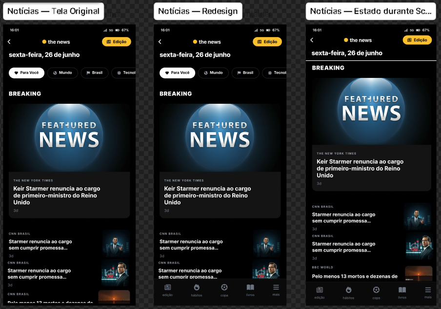

# The News — Front-end & Design Challenge

> Redesign das telas **News** e **Evento Seis&Seis** do aplicativo The News, com foco em experiência do usuário, consistência visual e implementação Front-end utilizando React e TypeScript.

---

# Introdução

Este projeto foi desenvolvido como parte do processo seletivo para a vaga de **Dev Front-end & Design** do **The News**.

Mais do que criar duas novas interfaces, o objetivo foi analisar criticamente o produto existente, identificar oportunidades de melhoria e propor soluções que respeitassem a identidade visual da marca, aumentassem a consistência entre as telas e melhorassem a experiência do usuário.

Como bônus do desafio, parte do redesign também foi implementada utilizando React e TypeScript, buscando reproduzir fielmente a interface criada durante a etapa de design.

---

# Objetivos do projeto

Desde o início, procurei evitar um redesign puramente estético.

A proposta foi resolver problemas reais de usabilidade mantendo a personalidade visual já consolidada pelo The News.

Os principais objetivos foram:

- melhorar a consistência entre as telas do aplicativo;
- reduzir a carga cognitiva durante a navegação;
- aumentar a área útil destinada ao consumo de conteúdo;
- simplificar padrões de navegação;
- preservar a identidade visual da marca;
- construir uma base de componentes reutilizáveis para uma futura evolução do produto.

---

# Auditoria do produto

Antes de iniciar qualquer alteração visual, foi realizada uma análise exploratória do aplicativo buscando identificar padrões, inconsistências e oportunidades de melhoria.

O objetivo dessa etapa não foi encontrar "erros", mas compreender quais decisões poderiam gerar maior impacto para a experiência do usuário.

## Principais oportunidades encontradas

| Oportunidade                                                     | Impacto esperado |
| ---------------------------------------------------------------- | ---------------- |
| Navegação inconsistente entre telas                              | Alto             |
| Cabeçalho excessivamente alto na tela News                       | Alto             |
| Ausência de padronização da navegação inferior                   | Alto             |
| Duplicidade de navegação na tela Evento                          | Alto             |
| Pequenas inconsistências de espaçamento e hierarquia             | Médio            |
| Diferenças visuais entre Dark Mode e Light Mode em algumas telas | Médio            |

### Navegação inconsistente

Durante a navegação foi possível observar que algumas telas utilizam Bottom Navigation enquanto outras adotam padrões diferentes.

Essa inconsistência faz com que o usuário precise reaprender como navegar dependendo da tela em que se encontra, aumentando a carga cognitiva e reduzindo a previsibilidade da interface.

---

### Header da tela News

A tela responsável pelo principal consumo de conteúdo do aplicativo possui um cabeçalho relativamente grande.

Embora ele cumpra sua função de contextualização, ocupa uma parcela significativa da área útil logo acima da dobra, reduzindo a quantidade de notícias visíveis e exigindo mais rolagem para acessar o conteúdo.

Como a principal atividade do usuário nessa tela é a leitura, essa característica chamou atenção durante a análise.

---

### Tela Evento

Na tela do Evento Seis&Seis existe uma mistura entre navegação global e ações específicas do próprio evento.

Na prática, ambas competem visualmente pela atenção do usuário.

Isso dificulta compreender rapidamente quais ações pertencem ao aplicativo e quais pertencem exclusivamente ao evento.

---

# Escolha das telas

O desafio solicitava o redesign de pelo menos duas telas.

Optei por trabalhar nas telas **News** e **Evento Seis&Seis** por acreditar que ambas apresentam alto potencial de impacto sem alterar a essência do produto.

## 1. News

A tela News representa o principal ponto de consumo de conteúdo do aplicativo.

Pequenas melhorias nessa interface possuem potencial para beneficiar praticamente toda a base de usuários.

As principais oportunidades identificadas foram:

- ampliar a área dedicada às notícias;
- melhorar a hierarquia visual;
- reduzir distrações durante a leitura;
- padronizar a navegação em relação às demais telas.

---

## 2. Evento Seis&Seis

A escolha da tela de Eventos ocorreu por um motivo diferente.

Enquanto a tela News apresenta oportunidades relacionadas ao consumo de conteúdo, a tela Evento apresentava oportunidades relacionadas à arquitetura de informação.

O objetivo foi separar melhor a navegação global das funcionalidades específicas do evento, tornando a experiência mais consistente e previsível.

---

# O que optei por NÃO mudar

Um redesign nem sempre significa reinventar um produto.

Em diversos momentos a decisão mais adequada foi preservar elementos que já funcionavam bem.

Optei por manter:

- a identidade visual da marca;
- a paleta principal de cores;
- a linguagem editorial do aplicativo;
- o estilo visual dos cards;
- a organização geral do conteúdo.

Essa decisão permitiu que as mudanças fossem percebidas como uma evolução natural da experiência, e não como uma ruptura com o produto existente.

---

# Principais decisões de design

## Header colapsável

A principal decisão da tela News foi transformar o cabeçalho em um elemento colapsável durante o scroll.

O objetivo não era remover informações importantes, mas preservar o contexto da tela enquanto aumentava a área disponível para leitura.

Com essa abordagem, elementos como data, identidade visual e ação principal permanecem acessíveis, porém ocupando menos espaço conforme o usuário avança pelo conteúdo.

Essa solução permite que mais notícias permaneçam visíveis sem comprometer a navegação.

---

## Priorização do conteúdo

Outra decisão importante foi reforçar a hierarquia visual.

O conteúdo editorial passou a ser claramente o elemento de maior destaque da tela.

Para isso foram reduzidas distrações visuais, reorganizados espaçamentos e estabelecida uma leitura mais fluida entre títulos, imagens e categorias.

---

## Padronização da navegação

A Bottom Navigation foi incorporada seguindo o mesmo padrão observado em outras áreas do aplicativo.

O objetivo não foi adicionar uma nova funcionalidade, mas tornar a navegação mais consistente e previsível.

Quando padrões se repetem ao longo do produto, o usuário precisa pensar menos sobre como navegar e pode concentrar sua atenção no conteúdo.

---

## Separação entre navegação global e contextual

Na tela Evento, a principal mudança consistiu em separar claramente aquilo que pertence ao aplicativo daquilo que pertence ao próprio evento.

A navegação global permaneceu responsável pelas principais áreas do aplicativo, enquanto as ações específicas do evento permaneceram agrupadas dentro do contexto da própria tela.

Essa reorganização reduz ambiguidades e melhora a compreensão da interface.

---

# Design System

Ao invés de criar uma nova identidade visual, optei por consolidar padrões já existentes em um pequeno Design System.

Essa abordagem permitiu manter aderência à linguagem visual do The News enquanto aumentava a consistência entre componentes e facilitava sua reutilização durante a implementação.

Os principais elementos definidos foram:

- paleta de cores baseada na identidade da marca;
- escala tipográfica consistente;
- sistema de espaçamento baseado em múltiplos de 8px;
- bordas e raios padronizados;
- componentes reutilizáveis como Header, Bottom Navigation, Cards, Botões, Chips e Carrosséis.

Além de beneficiar o redesign, essa organização também simplificou a implementação Front-end.

---

# Redesign

## Tela News

### Objetivos

- aumentar a área útil para leitura;
- reduzir distrações;
- melhorar a hierarquia visual;
- manter a identidade da marca.

---

## Tela Evento Seis&Seis

### Objetivos

- simplificar a navegação;
- separar ações globais das ações do evento;
- padronizar a experiência com o restante do aplicativo.

---

# Implementação Front-end

Como etapa complementar ao desafio, parte do redesign foi implementada utilizando React e TypeScript.

O objetivo dessa implementação não foi apenas reproduzir o layout, mas construir uma estrutura organizada, escalável e baseada em componentes reutilizáveis.

Devido ao tempo disponível para o desafio, a implementação funcional priorizou a tela **News**, por representar a principal tela de consumo do aplicativo e concentrar as decisões arquiteturais mais relevantes. A proposta da tela **Evento Seis&Seis** permaneceu documentada no Figma como evolução do redesign.

Durante a implementação foram adotadas práticas como:

- componentização;
- separação entre layout e conteúdo;
- reutilização de componentes;
- responsividade;
- acessibilidade;
- organização modular do projeto.

---

# O que eu faria com mais tempo

O projeto representa uma proposta de evolução baseada em heurísticas de UX e boas práticas de design.

Se houvesse mais tempo disponível, minha prioridade seria validar essas hipóteses com usuários reais.

Os próximos passos seriam:

- realizar testes de usabilidade;
- medir o impacto do Header colapsável no consumo das notícias;
- validar a nova arquitetura de navegação;
- expandir o Design System para outras telas do aplicativo;
- evoluir microinterações e animações;
- ampliar melhorias de acessibilidade.

Essas validações permitiriam confirmar se as decisões tomadas durante o redesign realmente produzem ganhos mensuráveis na experiência do usuário.

---

# Autocrítica

Um dos maiores desafios deste projeto foi encontrar um equilíbrio entre propor melhorias relevantes e, ao mesmo tempo, preservar a identidade construída pelo The News.

Em diversos momentos optei conscientemente por não adicionar novas funcionalidades, concentrando os esforços em melhorar aquilo que já existia.

Acredito que essa abordagem resultou em uma evolução mais coerente com o produto.

Ainda assim, reconheço que parte das decisões foi baseada em princípios de UX e observação qualitativa, não em dados reais de comportamento dos usuários.

Por isso, antes de considerar qualquer solução definitiva, seria fundamental validar as hipóteses através de testes de usabilidade e métricas de utilização.

---

# Links

## Figma

> https://www.figma.com/design/lDGjv0wIOAR1q2ZCxjUF4Y/screen?node-id=0-1&p=f&t=x1qwctDdxD4DTn4G-0

## Repositório

> https://github.com/IsaiasSantanaDosSantos/the-news-case

## Deploy

> https://the-news-case-pi.vercel.app/

---

# Considerações finais

Este projeto buscou demonstrar não apenas capacidade técnica na construção de interfaces, mas também a forma como analiso problemas de produto, tomo decisões de design e transformo essas decisões em uma implementação Front-end organizada.

A combinação entre análise, design e implementação representa a maneira como procuro desenvolver produtos: entendendo o problema antes de escrever a primeira linha de código.
